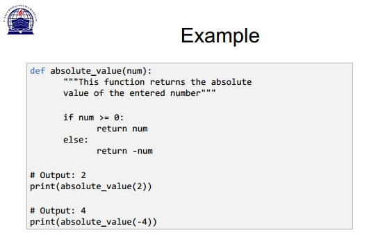
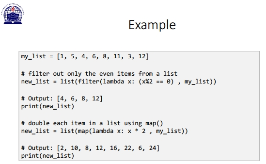
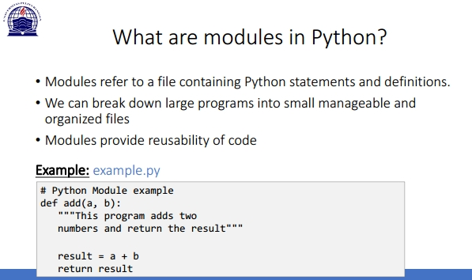
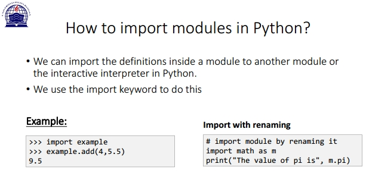
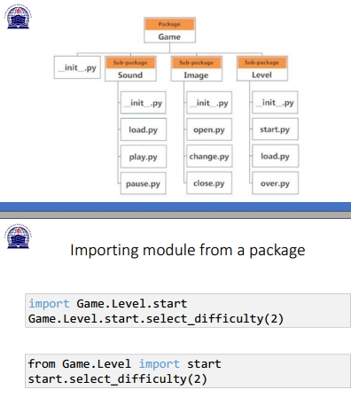

# 12_Praktikum 7

BAHASA PEMROGRAMAN

TEHNIK INFORMATIKA

UNIVERSITAS PELITA BANGSA

NAMA : GUNAWAN

NIM     : 312010191

KELAS   : TI.20.B1

DOSEN   : Agung Nugroho,S.Kom.,M.Kom

Tugas : Pertemuan 10

**Praktikum 7 : Pemrograman Modular / Fungsi**

- Sub Rutin / Fungsi

- The return statement

- Use of Lambda Function in python

- What are modules in Python?

- Python Package

• Packages are namespaces which contain multiple packages and
modules themselves. They are simply directories, but with a twist.
• Each package in Python is a directory which MUST contain a special
file called __init__. py
• This file can be empty, and it indicates that the directory it contains is a
Python package, so it can be imported the same way a module can be
imported.

-

