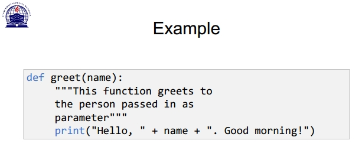

# 12_Praktikum 7

BAHASA PEMROGRAMAN

TEKNIK INFORMATIKA

UNIVERSITAS PELITA BANGSA

NAMA : GUNAWAN

NIM     : 312010191

KELAS   : TI.20.B1

DOSEN   : Agung Nugroho,S.Kom.,M.Kom

Tugas : Pertemuan 10

**Praktikum 7 : Pemrograman Modular / Fungsi**

**Sub Rutin / Fungsi**

What is a function in Python?

• In Python, function is a group of related statements
that perform a specific task.

• Functions help break our program into smaller and
modular chunks

• Functions make it more organized and manageable

• It avoids repetition and makes code reusable

**Syntax of Function**

• Keyword def marks the start of function header.

• A function name to uniquely identify it. Function naming follows the same rules of writing
identifiers in Python.

• Parameters (arguments) through which we pass values to a function. They are optional.

• A colon (:) to mark the end of function header.

• Optional documentation string (docstring) to describe what the function does.

• One or more valid python statements that make up the function body. Statements must have
same indentation level (usually 4 spaces).

• An optional return statement to return a value from the function.

>Code Program python.py  & Run :

**The return statement (Pernyataan kembali)**

• The return statement is used to exit a function and go back to the
place from where it was called.

• Syntax of return

``return [ expression_list]``

**Types of Functions**

• Basically, we can divide functions into the following

**two types:**

• Built-in functions - Functions that are built into Python.

• User-defined functions - Functions defined by the users
themselves.

**Python Function Arguments**

• In Python, you can define a function that takes variable number of
arguments.

**Variable Function Arguments**

• In user-defined function there are three kind of argument:

• Python Default Arguments

• Python Keyword Arguments

• Python Arbitrary Arguments

>Code Program python.py  & Run :

**Keyword Arguments**

• When we call a function with some values, these values get assigned
to the arguments according to their position.

• Python allows functions to be called using keyword arguments. When
we call functions in this way, the order (position) of the arguments
can be changed.

``>>> #2 keyword arguments``
``>>> greet(name = "Bruce", msg = "How do you do?")``
``>>> #2 keyword arguments (out of order)``
``>>> greet(msg = "How do you do?", name = "Bruce")``
``>>> #1 positional, 1 keyword argument``
``>>> greet("Bruce", msg = "How do you do?")``

**Arbitrary Arguments**

• Python allows us to handle this kind of situation through function
calls with arbitrary number of arguments.
• In the function definition we use an asterisk (*) before the parameter
name to denote this kind of argument.

``def greet(*names) :``
``"""This function greets all``
``the person in the names tuple. """``
``# names is a tuple with arguments``
``for name in names:``
``print("Hello", name)``
``greet("Monica", "Luke", "Steve", "John")``

**Python Anonymous/Lambda Function**

• In Python, anonymous function is a function that is defined without a
name.

• While normal functions are defined using the def keyword, in
Python anonymous functions are defined using the lambda keyword.

• Syntax of Lambda Function in python

``lambda arguments: expression``

**Example of Lambda Function in python**

• Here is an example of lambda function that doubles the input value.

``# Program to show the use of lambda functions``

``double = lambda x: x * 2``

``# Output: 10``

``print(double(5) )``

**Use of Lambda Function in python**

• We use lambda functions when we require a nameless function for a
short period of time.

• Lambda functions are used along with built-in functions like
filter() , map() etc.

>Code Program python.py  & Run :

# Package & Module

**What are modules in Python?**

• Modules refer to a file containing Python statements and definitions.

• We can break down large programs into small manageable and
organized files

• Modules provide reusability of code

Example: example.py

# Python Module example

``def add(a, b) :``

``"""This program adds two``

``numbers and return the result"""``

``result = a + b``

``return result``

**Python Package**

• Packages are namespaces which contain multiple packages and
modules themselves. They are simply directories, but with a twist.
• Each package in Python is a directory which MUST contain a special
file called __init__. py
• This file can be empty, and it indicates that the directory it contains is a
Python package, so it can be imported the same way a module can be
imported.

-

